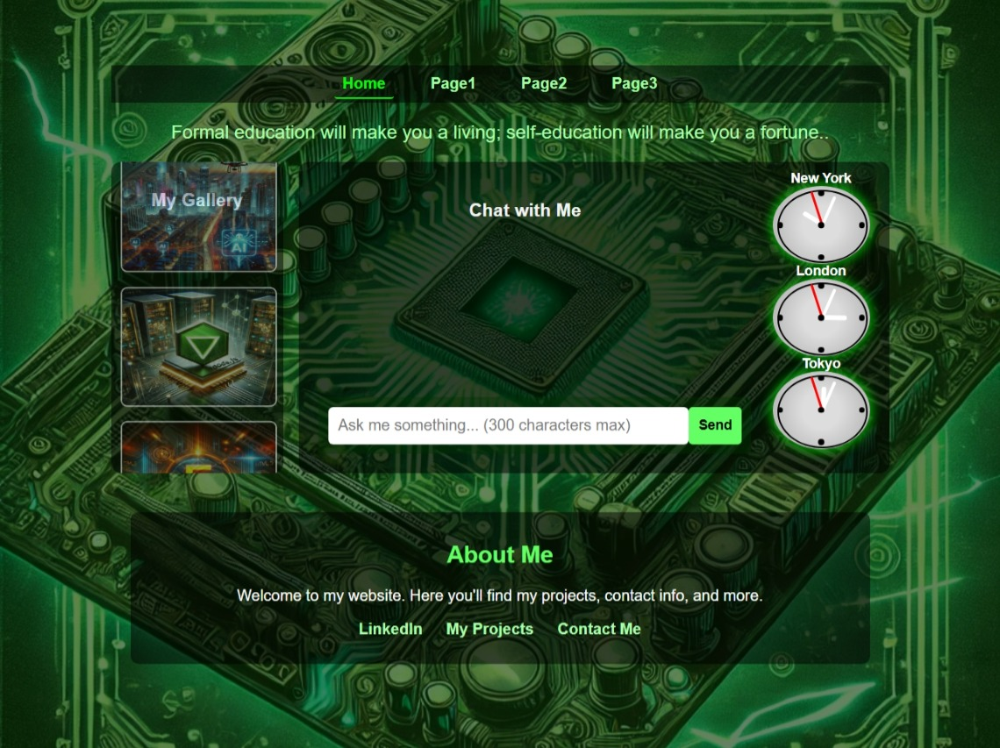
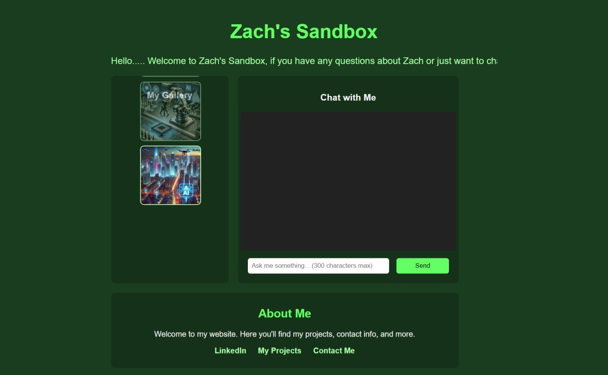
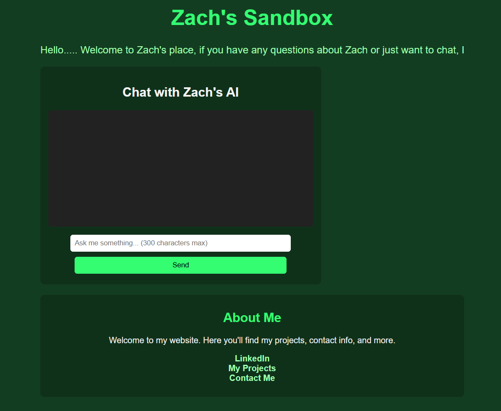

<h1 align="center" style="color: #4CAF50;">Zach's Sandbox</h1>

<h3 align="center" style="color:#13b2e3;">@@ Status: In Development (Share your ideas please!) @@</h3>

---
## Table of Contents  
- [Features Implemented](#features-implemented)  
- [Installation & Setup](#installation--setup)  
- [Current Project Structure](#current-project-structure)  
- [How to Test the API](#how-to-test-the-api)  
- [Contributing](#contributing)
- [Versions](#versions)
---
<h2 id="features-implemented" style="color: #2196F3;">Features Implemented</h2>

- AI Chatbox API (Rate-limited to 3 messages per session)  
- Email Forwarding (User messages are forwarded via email)  
- Organized Styles in `/styles/` (modular CSS structure for better maintainability)
- Integrated Photo Box (Vertically scrolling photo gallery with automated animations)
- World Clock Component (Displays live time for key time zones)
- Navigation Bar (Interactive, dynamic content loading)

WIP: Logging, Stock Data Integration, Responsive UI

---
<h2 id="installation--setup" style="color: #E91E63;">Installation & Setup</h2>

### Install Dependencies
```sh
npm install
```
### Set Up Configuration
Create a `.env` file (or modify `config.js`) with your API keys and email credentials.
```js
module.exports = {
    email: {
        from: "your-email@gmail.com",
        to: "ZacharyH@gmail.com",
        password: "your-email-password"
    },
    server: {
        port: process.env.PORT || 3000,
        apiKey: "your-api-key"
    }
};
```
### Start the Server
```sh
npm start
```
Server should be running on: `http://localhost:3000`

---
<h2 id="how-to-test-the-api" style="color: #9C27B0;">How to Test the API</h2>

### Test with cURL
```sh
curl -X POST http://localhost:3000/ask-ai -H "Content-Type: application/json" -H "x-api-key: your-api-key" -d '{"prompt":"Hello AI!"}'
```
### Test with Postman
1. Open Postman  
2. Set a POST request to `http://localhost:3000/ask-ai`  
3. Add Headers:  
   - `"Content-Type": "application/json"`  
   - `"x-api-key": "your-api-key"`  
4. Body (JSON format):
```json
{ "prompt": "Hello AI!" }
```
5. Click Send and verify the response.

---

<h2 id="contributing" style="color: #795548;">Contributing</h2>

- Me and You?

## Work Progress & Screenshots

Nothing is better than a visual.

### **Versions**
**3.0.0**

---

---

